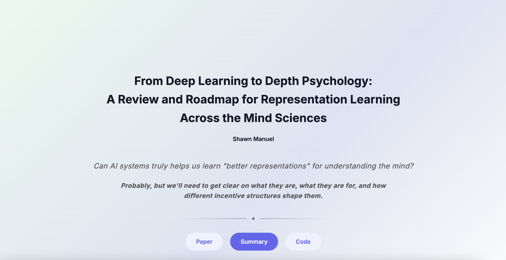

<h1 align="center">From Deep Learning to Depth Psychology: A Review and Roadmap for Representation Learning Across the Mind Sciences.</h1>

<div align='center'>
    <a href='https://scholar.google.ca/citations?user=LxMWm1wAAAAJ&hl=en' target='_blank'><strong>Shawn Manuel</strong></a><sup> 1,2</sup>&emsp;
    <!-- <a href='https://scholar.google.com/citations?user=6Q0JvLoAAAAJ&hl=en&oi=sra' target='_blank'><strong>Jean Gagnon</strong></a><sup> 1</sup>&emsp;
    <a href='https://scholar.google.com/citations?user=V_4V14gAAAAJ&hl=en&oi=ao' target='_blank'><strong>Frédéric Gosselin</strong></a><sup> 1</sup>&emsp; -->
    <!-- <a href='https://scholar.google.com/citations?user=XrBcghcAAAAJ&hl=en' target='_blank'><strong>Vincent Taschereau-Dumouchel</strong></a><sup> 1,2</sup>&emsp; -->
</div>

<div align='center'>
    <sup>1 </sup> Department of psychology, Université de Montréal
&emsp; <sup>2 </sup>Centre de recherche de l’institut universitaire en santé mentale de Montréal
&emsp;
</div>

<br>
<div align="center">
 <a href=''></a>
 <a href='https://shwnmnl.github.io/representations'></a>
 <!-- <a href='https://huggingface.co/spaces/shwnmnl/DeepProjection'></a> -->
</div>
<br>
<p align="center">
    
</p>

## Introduction

This repo contains code to partially reproduce the figures of the preprint [From Deep Learning to Depth Psychology: A Review and Roadmap for Representation Learning Across the Mind Sciences](). 

An interactive timeline of Figure 2's *Key Milestones in Neuroscience, Psychology, and AI (1940-2025)* can be explored on the [companion website](https://shwnmnl.github.io/representations).

All plots in the paper were at least partially programmatically generated, and can be recreated/adapted from the `representations-across-the-mind-sciences.ipynb` notebook.

## Directory Structure

```
RepsReview/
├── assets/
│ └── reps-webpreview.png
├── src/
│ ├── index.html
│ └── representations-across-the-mind-sciences.ipynb
├── LICENSE
├── README.md
└── requirements.txt
```

## Detailed Descriptions
- **assets/**: Contains image files used for this README file.
  - **purple-night-nolabels.png**: Project emblem

- **src/**: Contains source code for the project.
  - **index.html**: Single file for the website
  - **representations-across-the-mind-sciences.ipynb**: Notebook containing all "final" plots, as well as a graveyard of past iterations. 

- **LICENSE**: The license under which the project is distributed.

- **README.md**: The main README file you are currently reading.

- **requirements.txt**: Lists the Python packages required to run the project.